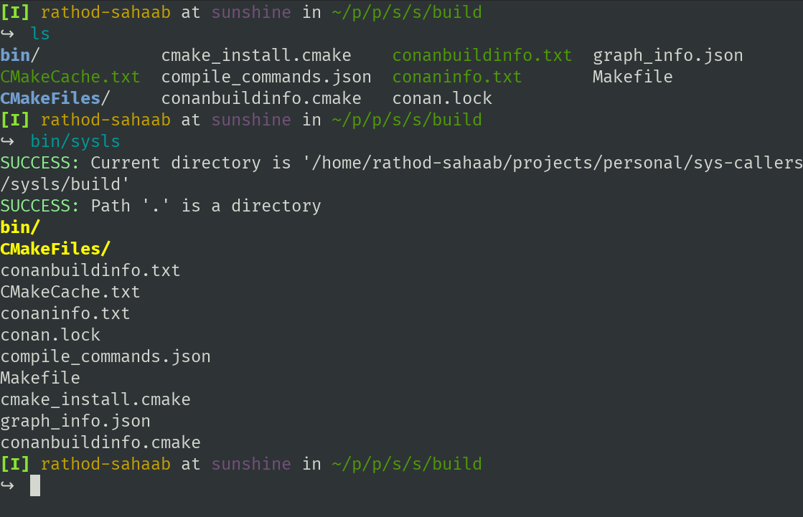
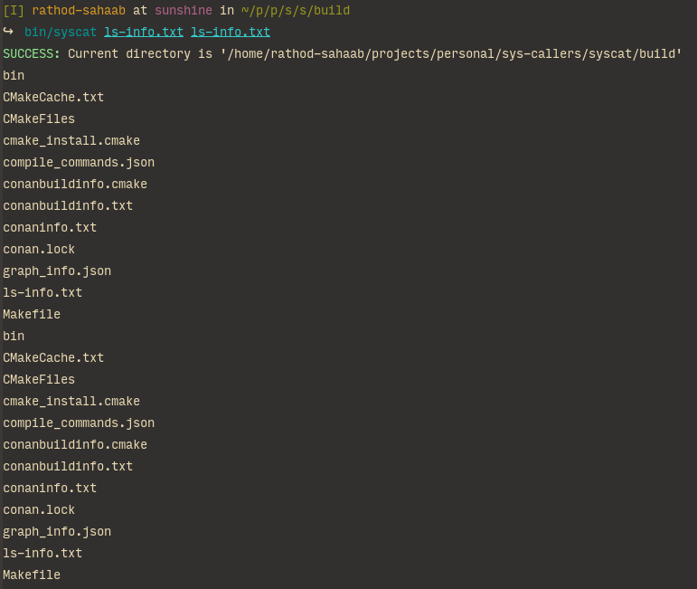

# sys-callers

Want to learn _linux programming_? me too!

This project implements many standard tools like:

- [x] ls (sysls)
- [x] cat
- [ ] cp
- [ ] curl

etc.

Every project is an independent one residing in this monorepo.
We use C++17 for easing trivial tasks like output formating,
argument parsing etc. so that we can focus more on our main
objectives _i.e._ **syscalls**.

Projects follow [rathod-sahaab/cpp-conan-template](https://github.com/rathod-sahaab/cpp-conan-template).

### sysls

Minimal file lister (ls functionality)

### syscat

Minimal cat clone (cat functionality)

